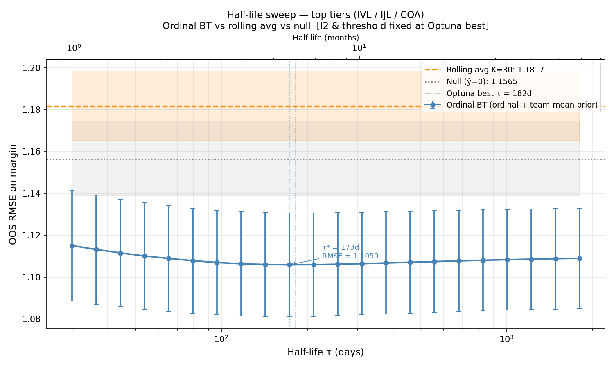
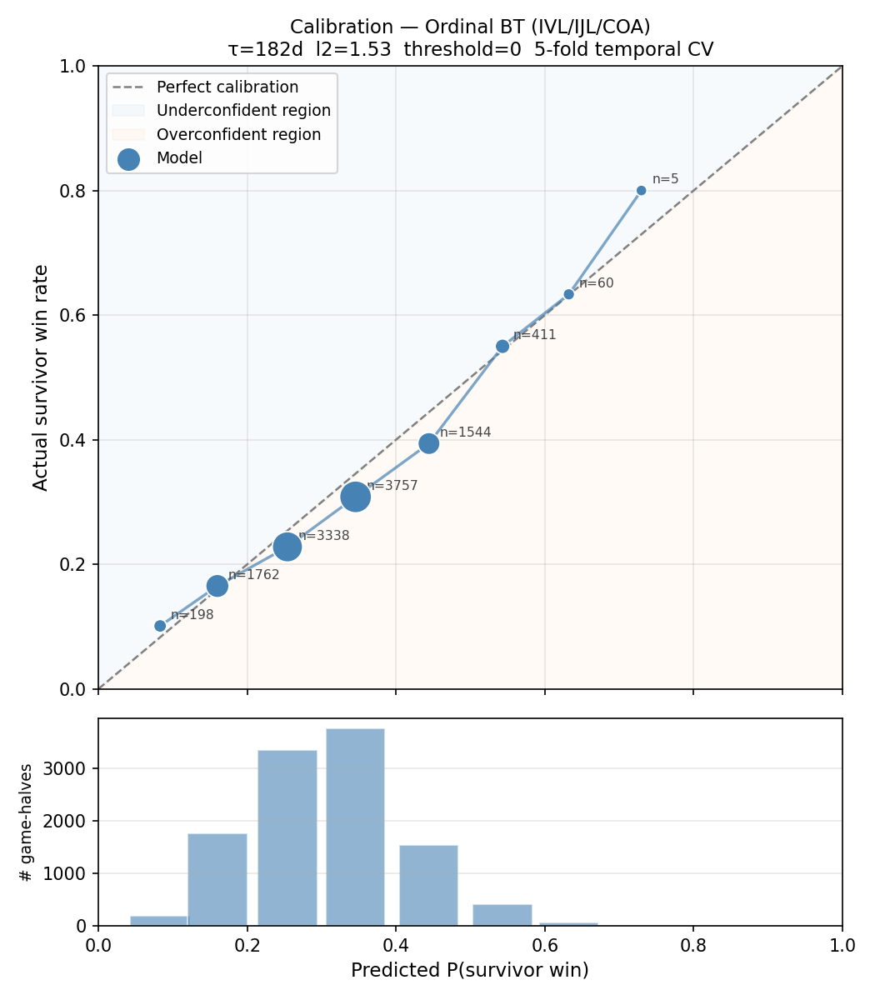

# How fast does competitive skill information become obsolete in a high-frequency esports environment?

In this project, we applied ordinal Bradley-Terry model with a few adaptations to ~15,700 games of pro Identity V esports to quantify player skill and measure the rate at which historical match data becomes stale. 

Thank you Identity V Bwiki.
Website:
Technical write-up:

## Introduction
Identity V is a asymmetric 1v4 mobile game developed by NetEase, published in 2018. In each game, 1 hunter faces 4 survivors, and the outcome is the number of survivors who escape (0–4), making match results an ordered categorical variable rather than a binary win/loss.

Since the first COA I in 2018, Identity V esports have gone through 9 years. A pro-esports league in China (IVL) was established in 2020, and a pro-esports league in Japan (IJL) was established in 2022. In this project, we ask 2 main questions

1. **Do individual player ratings carry predictive signal about future match outcomes?**
2. **How quickly does that signal decay as the competitive meta evolves?**

The central finding is that top-tier competitive skill information has a half-life of roughly **182 days**, and the model achieves **$R^2$ = 8.6%** against the null baseline (which predicts a draw for every game) under strict temporal cross-validation. The last fold achieves $R^2 = $ 15.2% against the null model.

| Metric | Value |
|--------|-------|
| Optimal half-life τ\* | **182 days** |
| R² vs null (predict all draws) | **8.6%** |
| Series win accuracy | **63.8%** |

## Data & Outcome
Data were sourced from [Identity V Bwiki](https://wiki.biligame.com/idv/), which manually records professional match results. Data cover almost all competitive events from **2020-06-25 to 2026-05-05**, including 2049 unique players across all tiers (1,516 survivor-only, 462 hunter-only, 71 dual-role). The top-tier model (IVL/IJL/COA) rates 1,383 players: 1,018 survivors and 365 hunters.

| Tier | Half-games | Description |
|------|----------:|-------------|
| IVL | 6,877 | IVL (China main league) |
| COA | 3,946 | Championship of Abyss (international) |
| IJL | 2,561 | IJL (Japan league) |
| IVC | 1,336 | Top Amateur Tournament |
| IVT | 549 | Regional |
| IVS | 422 | Regional |
| **Total** | **15,691** | |

The outcome per game is determined by a margin = n_escaped $- 2 \in \{−2, −1, 0, +1, +2\}$. That is, a positive score indicates a survivor advantage, while a negative score indicates a hunter advantage. 

## Methodology

### Ordinal Bradley-Terry
The main model is Ordinal Bradley-Terry model with a few adaptations. Each player $p$ has a latent skill score $\beta_p$. For a half-game with hunter $h$ and survivors $s_1 \ldots s_4$, the **linear predictor** is:
$$\eta = \frac{1}{4}\sum_{k=1}^{4} \beta^S_{s_k} - \beta^H_h$$
Intuitively, a high $\beta$ value means more skilled at the respective role.

We used L-BFGS-B with analytical gradient to fit the model ordinal MLE, with each player's skill as a parameter. Since the difficulty of going from 0 escape to 1 escape is not the same as 3 escape to 4 escapes, this linear predictor feeds a proportional-odds (cumulative logit) model to learn the threshold for each outcome. After ordinal regression, we discovered that the threshold is 0.75 / 1.69 / 2.40. The ordinal model performs 15% better than the linear model.

### Time Decay
To account for the fast-paced competitive landscape, every match in the training set has a weight $w_i$ associated with it, determined solely by how long the match has been relative to the newest match. That is,
$$ w_i = \left(\frac 12\right)^{\Delta t_i/\tau}$$
where $\Delta t_i$$ is the age of the match and $\tau$ is the optimal half life. This is the same exponential decay used in factor research to down-weight stale signals. 

### Additional Components
- **L2 ridge regularization** — shrinks all $\beta$ toward zero and penalized players with less data. Gaussian prior interpretation equivalent to portfolio covariance shrinkage.
- **Team-mean informed prior** — players with fewer than `threshold` training matches have their L2 prior centered at their first-match teammates' mean $\beta$, rather than zero. This is to encode the fact that strong teams tend to recruit strong players.
- **Hyperparameter tuning** — $\tau$, $\lambda$ (L2 strength), and `threshold` are jointly optimized via Optuna's TPE sampler under temporal CV.

## Evaluation
The model is evaluated by a 5 fold temporal cross-validation to prevent look-ahead bias: training data always strictly precedes test data, mirroring the backtesting discipline. The model is evaluated by both the top tiers only data and all tiers data, as pro players in the top tiers tend to be fast pace in the more competitive environment compared to amateur players.

### Baselines

| Baseline | Description | RMSE (top tiers) |
|----------|-------------|:----------------:|
| Null | Predict 0 (draw) every match | 1.156 |
| Average ($K = \infty$) | Sum each player's avg margin from the past $K$ games | 1.150 |
| Linear BT | Closed-form ridge, same structure | 1.115 |
| **Ordinal BT** | Final model | **1.105** |

The average baseline is *worse* than the null model at every K below ~300, and barely positive at $K = \infty$. 

### Half-Life Sweep
To directly observe the effect of half-life, we fix all other hyper-parameters, and sweep for the half life from 1 to 1800, on a log scale.

The x-axis is $\tau$, y-axis is out-of-sample RMSE under 5-fold temporal CV. The graph gives $\tau$ = 173d, consistent with the optuna best $\tau$ = 182d.

### Calibration
Next, we have the calibration plot compares predicted win rate of survivors against empirical frequencies across the test set.

Well-calibrated probabilities lie on the diagonal. The model is well-calibrated across all five outcome categories.

### Accuracy
The outcomeprediction for a single game is noisy due to the huge variance and outside factors that were not included in the model, and as such are much less stable than series prediction. Given the actual lineups per round, the probability of each team winning the series is computed via dynamic programming over round-win states.

| Model | Series Accuracy | Brier Score | Brier Reduction |
|-------|:--------------:|:-----------:|:---------------:|
| Null (always predict home win) | 51.4% | 0.4860 | -94.4% |
| Average ($K = \infty$) | 51.0% | 0.2570 | −2.8% |
| **Ordinal BT** | **63.8%** | **0.2197** | **+12.1%** |

## Findings

### Half Life
The optimal $τ^* = 182$ days means a match from 6 months ago is weighted half as much as a match from today. Matches more than 2 years old contribute less than 6% weight. This is the answer to the central research question: top-tier competitive skill information becomes substantially stale in about one competitive season. 

### 2023 IVL Meta-Shift
The per-fold break down is shown below, where $R^2$ increased as more training data becomes available.

| Fold | Approx. test period | R² vs null 
|------|-------------------|:----------:|
| 1 | 2020–2021 | 2.4% |
| 2 | 2021–2022 | 4.8% | 
| 3 | 2022–2023 | 6.1% | 
| 4 | 2023–2024 | 14.4% | 
| 5 | 2024–2026 | 15.2% | 
| **Mean** | | **8.6%** | 

Interestingly, in 2023-2024 season, IVL suffers severe loss in $R^2$. When computing the $R^2$ for 2023-2024 season for IVL only, the $R^2$ sits at -1.1%. That is, it is even worse than the null model during the time period.

This is not a model failure, but rather a structural break with the competitive atmosphere in IVL. In 2023, the meta started as extremely survivor favoring, and since then it has became more and more hunter favoring. The specific regime change point is around October 15th, 2023, when 2023 IVL Fall started. 

| Period | Survivor win | Draw | Hunter win |
|--------|:-----------:|:----:|:----------:|
| Pre 2023-10-15 | 37.2% | 36.8% | 26.0% |
| Post 2023-10-15 | 21.8% | 41.9% | 36.3% |

## Analysis
In this section, we will examine the different half life across different categories.

### Top Tiers vs. All Tiers
So far, we have focused on the top tier tournaments, as players in professional leagues have more information to analyze on. We can also look at data from all tiers and compare the differences.

| Config | $\tau^2$ | $R^2$ vs null |
|--------|----:|:----------:|
| Top tiers (IVL/IJL/COA) | 182 d | 8.6% | 
| All tiers | 539 d | 9.0% | 
The all-tiers model uses a much longer half-life (539 days ≈ 18 months) despite achieving slightly better R². This reflects two distinct effects:

1. **Lower-tier data is more stable.** IVC/IVT/IVS players have fewer games as they do not have many official tournaments to participate in. Lower tier competitions also tend to be less competitive, which help extends amateur players
2. **Cross-tier calibration.** Including all tiers means the model encounters the same players in both IVL and lower-tier tournaments, improving cross-tier calibration through more games per player.

### Pre-2023 vs. Post-2023
As a result of the 2023 meta shift, we looked into the the half-life both before and after
### Hunter vs. Survivors
Running separate role-only optimizations (each player's skill estimated only from their primary role's data, evaluated on top-tier matches only), we obtained the following results.

| Role | $\tau^*$ | Best $R^2$ |
|------|----:|:-------:|
| Hunter | 153 days | 5.6% |
| Survivor | 123 days | 3.7% |
| Combined (both roles) | 182 days | 8.6% |

There are 3 observations we can make
1. **Hunter skill decay slower.** Although the original hypothesis was that hunter players are affected by the meta more, the optimal half-life says otherwise. This is likely due to the fact that survivors are heavily dependent on the team, and the same player within two different teams can have drastically different performances.
2. **Hunters carry more predictive signal**  A single exceptional hunter has more individual impact on the outcome than any single one of four survivors. This aligns with the 1v4 structure: one strong hunter can dominate; one strong survivor cannot guarantee a win against a skilled hunter.

## Limitations
The model can only assess player skills, but esport game data is noisy for that. There are many other impactful factors (i.e maps and characters) that were not included in the model. Some of the important ones include

**2023 Meta Shift.** Meta-shift in general is unpredictable. An additional regime decay score were added as an attempt to lighten the reliance on pre-2023 data after the meta shift, but no model variant in this project recovers this fold fully. This is an inherent limitation of any retrospective skill model applied across a structural break.

**No character-level effects.** The model rates players, not character picks. Hunter character choice is a large strategic decision. Character-level fixed effects were explored but did not improve out-of-sample prediction, likely due to cold-start issues in test folds with new characters.

**No map effects.** Map fixed effects improve in-sample fit (Spearman ρ = 0.97 between learned map effects and raw per-map margins) but consistently hurt out-of-sample prediction by 0.002–0.003 RMSE, likely because map picks are correlated with team identity and draft strategy.

**Survivor collinearity.** It is impossible to distinguish between two survivors who have always been playing together. The model does not consider any individual factor within a game, but relies solely on the team outcome.

## Interactive Website
An interactive website accompanies this analysis and is hosted at: [https://darshmallow.github.io/Idv-Prediction/], with both Chinese and English version available. 

Features:
- **Leaderboard** — browse all rated players with filters by role (hunter/survivor) and minimum game count; ranked independently within each role
- **Series predictor** — select two 5-player teams (1 hunter + 4 survivors each), choose a series format (Bo1–Bo7), and get exact win probabilities via DP and an animated Monte Carlo simulation of the series
- **Half predictor** — per-half win probability and expected margin for any matchup

## Reproducibility

